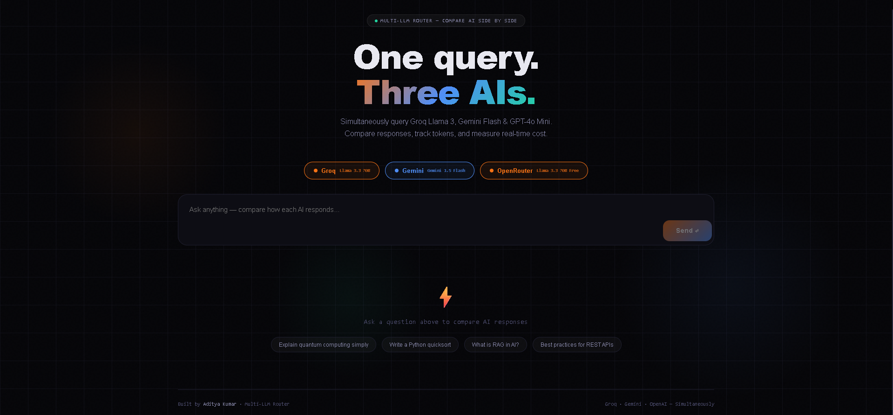
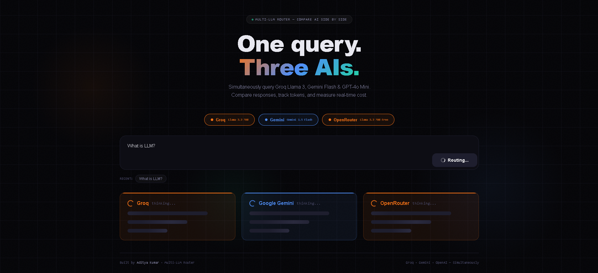

<div align="center">

[](https://multi-llm-router.vercel.app/)

[](https://fastapi.tiangolo.com)
[](https://nextjs.org)
[](https://python.org)
[](https://typescriptlang.org)

**[🚀 Live Demo](https://multi-llm-router.vercel.app/)** · **[📖 API Docs](https://multi-llm-router-5qmn.onrender.com/docs)**

</div>

---

## 🖼️ Screenshots





---

## 🧠 What It Does

Most people use one AI at a time. This project routes your query to **3 LLMs simultaneously** and returns:

- **Side-by-side responses** from each model
- **Token usage** (input + output) per model
- **Real cost in USD** per query per model
- **Latency comparison** — which model was fastest
- **Total cost** across all models

This is exactly the architecture powering platforms like **AI Fiesta** — multiple LLMs, one interface.

---

## 🏗️ Architecture

```
User Query
    │
    ▼
Next.js Frontend (Vercel)
    │
    ▼  POST /api/chat
FastAPI Backend (Render)
    │
    ├──── asyncio.gather() ──── Groq API     (Llama 3.3 70B)
    ├──── concurrent          ─ Gemini API   (1.5 Flash)
    └──── execution           ─ OpenRouter   (Llama 3.3 70B Free)
    │
    ▼
Aggregated Response
{results, total_cost, fastest_model}
```

**Key design choices:**
- `asyncio.gather()` + `ThreadPoolExecutor` → all 3 APIs called **in parallel**, not sequentially
- Each service is isolated → easy to add new LLMs
- Token costs calculated server-side using official pricing

---

## 🛠️ Tech Stack

| Layer | Tech |
|-------|------|
| Backend | FastAPI, Python 3.11, asyncio |
| LLM SDKs | Groq, google-generativeai, OpenRouter |
| Frontend | Next.js 16, TypeScript, React 18 |
| Deployment | Render (backend), Vercel (frontend) |
| CI/CD | GitHub → auto-deploy on every push |

---

## 🚀 Local Setup

### Backend

```bash
cd backend
python -m venv venv
source venv/bin/activate  # Windows: venv\Scripts\activate
pip install -r requirements.txt

cp .env.example .env
# Add your API keys to .env

uvicorn main:app --reload --port 8000
```

Backend runs at `http://localhost:8000`
API docs at `http://localhost:8000/docs`

### Frontend

```bash
cd frontend
npm install

cp .env.local.example .env.local
# Edit NEXT_PUBLIC_API_URL=http://localhost:8000

npm run dev
```

Frontend runs at `http://localhost:3000`

---

## 🔑 Environment Variables

### Backend `.env`
```
GROQ_API_KEY=your_groq_api_key
GEMINI_API_KEY=your_gemini_api_key
OPENROUTER_API_KEY=your_openrouter_api_key
```

| Key | Get it from |
|-----|------------|
| GROQ_API_KEY | [console.groq.com](https://console.groq.com) — Free |
| GEMINI_API_KEY | [aistudio.google.com](https://aistudio.google.com) — Free |
| OPENROUTER_API_KEY | [openrouter.ai/keys](https://openrouter.ai/keys) — Free |

### Frontend `.env.local`
```
NEXT_PUBLIC_API_URL=https://multi-llm-router-5qmn.onrender.com
```

---

## 📦 API Reference

### `POST /api/chat`

```json
// Request
{
  "query": "Explain quantum computing simply",
  "models": ["groq", "gemini", "openai"]
}

// Response
{
  "query": "Explain quantum computing simply",
  "fastest_model": "Groq",
  "total_cost_usd": 0.000023,
  "results": [
    {
      "provider": "Groq",
      "model_name": "llama-3.3-70b-versatile",
      "response": "Quantum computing uses...",
      "input_tokens": 12,
      "output_tokens": 187,
      "total_tokens": 199,
      "cost_usd": 0.000005,
      "latency_ms": 823.4,
      "error": null
    }
  ]
}
```

### `GET /api/models`
Returns list of available models.

### `GET /health`
Health check endpoint.

---

## 💰 Cost Comparison (per 1M tokens)

| Model | Input | Output |
|-------|-------|--------|
| Groq Llama 3.3 70B | $0.59 | $0.79 |
| Gemini 1.5 Flash | $0.075 | $0.30 |
| OpenRouter Llama 3.3 | Free | Free |

A typical query costs **~$0.000005 – $0.00005** total across all 3 models.

---

## 🗂️ Project Structure

```
multi-llm-router/
├── backend/
│   ├── main.py              # FastAPI app entry point
│   ├── models.py            # Pydantic request/response models
│   ├── requirements.txt
│   ├── routers/
│   │   └── chat.py          # /api/chat endpoint (concurrent calls)
│   └── services/
│       ├── groq_service.py
│       ├── gemini_service.py
│       └── openai_service.py  # OpenRouter
└── frontend/
    ├── src/
    │   ├── app/
    │   │   ├── layout.tsx
    │   │   ├── page.tsx     # Main UI
    │   │   └── globals.css
    │   └── types.ts
    ├── package.json
    └── next.config.js
```

---

## 👨‍💻 Author

<div align="center">

**Aditya Kumar** — Full Stack Engineer · AI Application Developer

[Portfolio](https://adityakr09-portfolio.netlify.app) · [GitHub](https://github.com/adityakr09) · [LinkedIn](https://www.linkedin.com/in/adityakrO1)

*Built to understand multi-LLM orchestration — the core architecture behind platforms like AI Fiesta.*

</div>


